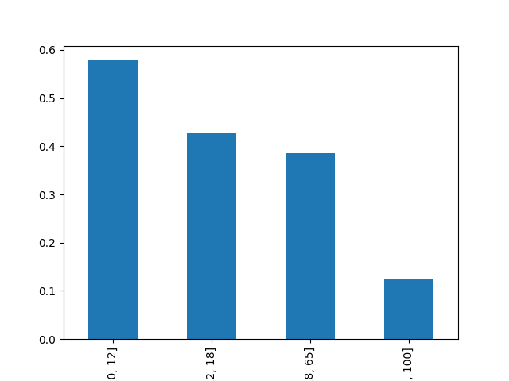
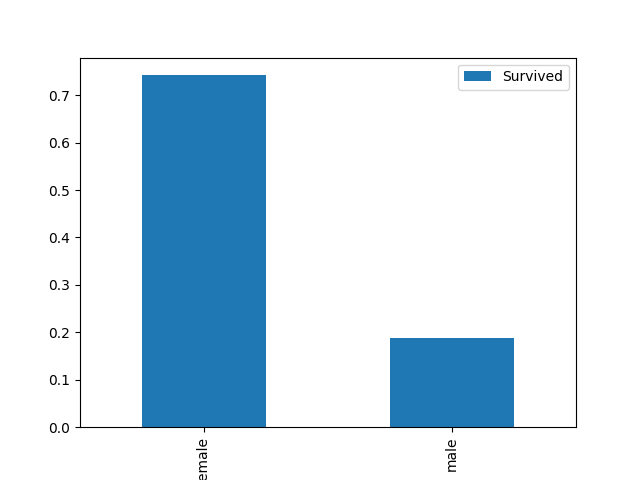

# Tianic

## 1. 导入数据
```python
import pandas as pd
import matplotlib.pyplot as plt
data_train = pd.read_csv("train.csv")
data_test=pd.read_csv("test.csv")
```

## 2. 对数据进行推断->特征分析->特征工程->建模->测试->提交
### 2.1 推断
考虑与生存率相关的特征：（通过图表进行分析）
为方便分析，对于所有的年龄段进行分类
1. 年龄
```python
t=[0,12,18,65,100]#对年龄段进行区间划分
data_train['ages']=pd.cut(data_train['Age'],t)#pd.cut()函数，对数据进行分段->并且返回一个Series
data_train.groupby(['ages'])['Survived'].mean().plot.bar()#对ages进行分组，计算每组的生存率
plt.show()#显示图表
```
具体的分析图如下：


2. 性别
```python
data_train[['Sex','Survived']].groupby(['Sex']).mean().plot.bar()#对性别进行分组，计算每组的生存率，.groupby()函数返回一个DataFrame,.mean()函数返回一个Series,.plot.bar()函数返回一个图表
plt.show()
```
具体的分析图如下：


3. 姓名Title
```python
data_train['Title']=data_train['Name'].str.extract(' ([A-Za-z]+)\.', expand=False)#.str.extract()函数，提取字符串中的特定内容--->python正则表达式
pd.crosstab(data_train['Title'],data_train['Sex'])

```
<font color='red'>Ps:</font>
python正则表达式内容，及文本处理相关部分：
