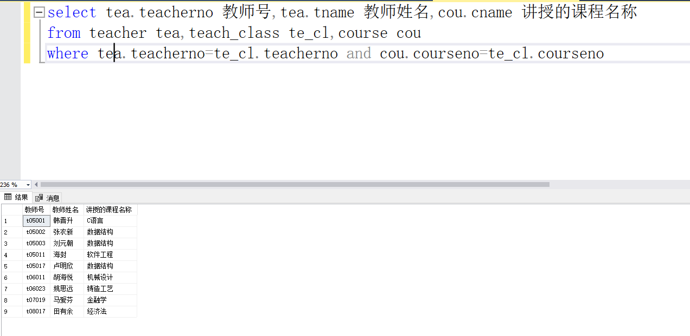
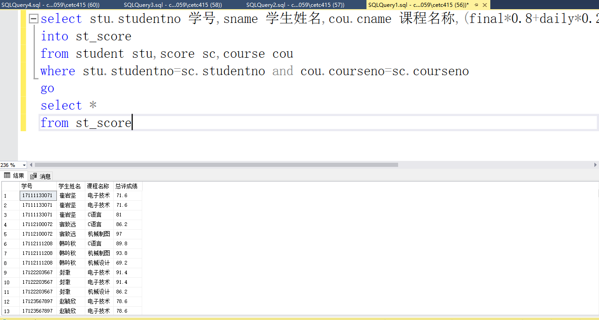
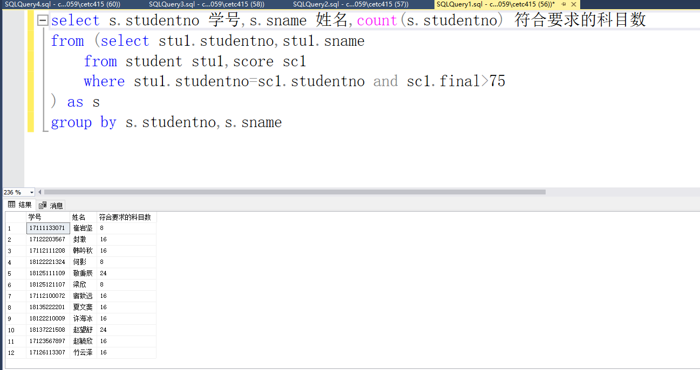
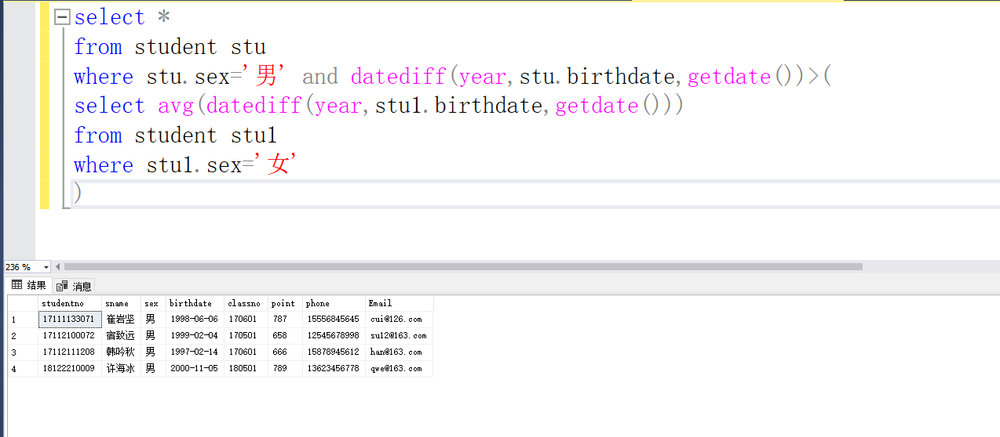
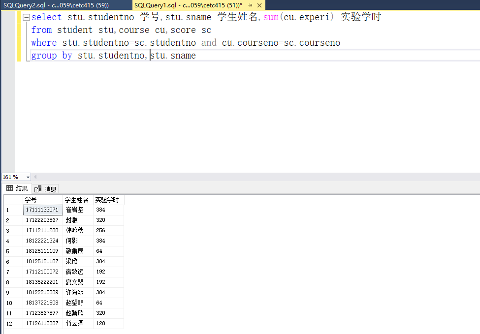
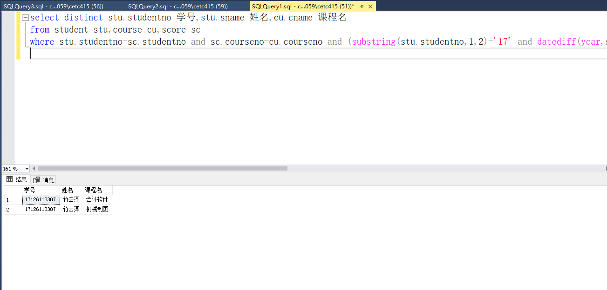
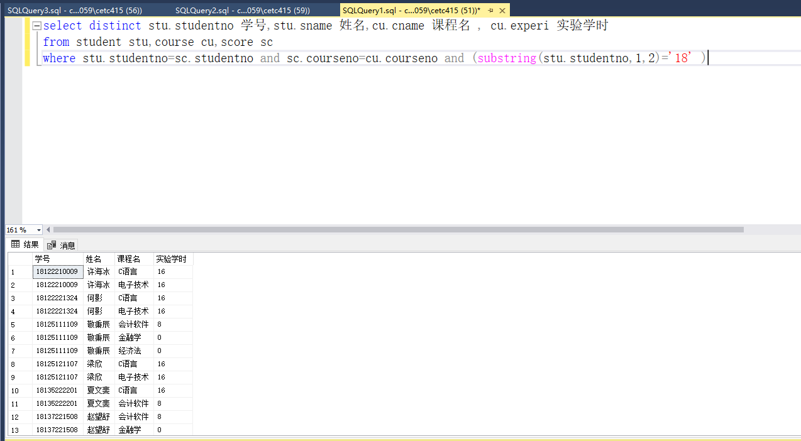
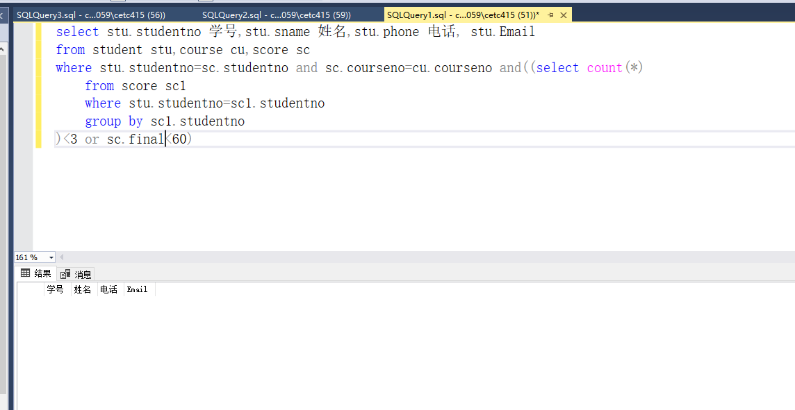

# 2023_4_27实验报告

## 上机练习题：

（1）：

```sql
select tea.teacherno 教师号,tea.tname 教师姓名,cou.cname 讲授的课程名称
from teacher tea,teach_class te_cl,course cou
where tea.teacherno=te_cl.teacherno and cou.courseno=te_cl.courseno
```



（2）：
```sql
select stu.studentno 学号,sname 学生姓名,cou.cname 课程名称,(final*0.8+daily*0.2) 总评成绩
into st_score
from student stu,score sc,course cou
where stu.studentno=sc.studentno and cou.courseno=sc.courseno 
go
select *
from st_score
```



（3）：
```sql
select s.studentno 学号,count(s.studentno) 符合要求的科目数
from (select stu1.studentno,stu1.sname
	from student stu1,score sc1
	where stu1.studentno=sc1.studentno and sc1.final>75
) as s
group by s.studentno
```



（4）：
```sql
select *
from student stu
where stu.sex='男' and datediff(year,stu.birthdate,getdate())>(
select avg(datediff(year,stu1.birthdate,getdate()))
from student stu1
where stu1.sex='女'
)
```



（5）：

```sql
select stu.studentno 学号,stu.sname 学生姓名,sum(cu.experi) 实验学时
from student stu,course cu,score sc
where stu.studentno=sc.studentno and cu.courseno=sc.courseno
group by stu.studentno,stu.sname
--或者--
select stu.studentno 学号,stu.sname 学生姓名,sum(cu.experi) 实验学时
from student stu INNER JOIN score sc
ON stu.studentno=sc.studentno
INNER JOIN course cu
ON cu.courseno=sc.courseno
where stu.studentno=sc.studentno and cu.courseno=sc.courseno
group by stu.studentno,stu.sname
```



（6）：
```sql
select distinct stu.studentno 学号,stu.sname 姓名,cu.cname 课程名 
from student stu,course cu,score sc
where stu.studentno=sc.studentno and sc.courseno=cu.courseno and (substring(stu.studentno,1,2)='17' and datediff(year,stu.birthdate,'2018-01-01')<19) and (substring(stu.studentno,1,2)='17' and datediff(year,stu.birthdate,'2017-01-01')<19)

```



（7）：
```sql
select distinct stu.studentno 学号,stu.sname 姓名,cu.cname 课程名 , cu.experi 实验学时
from student stu,course cu,score sc
where stu.studentno=sc.studentno and sc.courseno=cu.courseno and (substring(stu.studentno,1,2)='18' )
```



（8）：
```sql
select stu.studentno 学号,stu.sname 姓名,stu.phone 电话, stu.Email
from student stu,course cu,score sc
where stu.studentno=sc.studentno and sc.courseno=cu.courseno and((select count(*)
	from score sc1
	where stu.studentno=sc1.studentno
	group by sc1.studentno
)<3 or sc.final<60)
```

