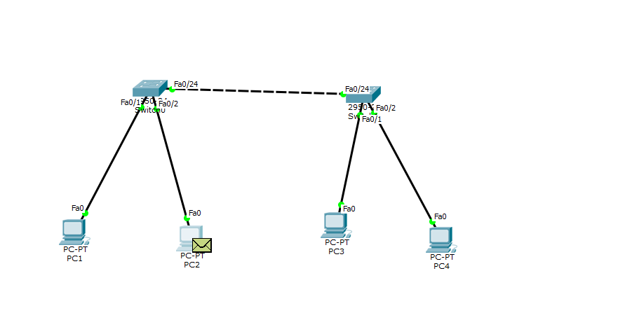

# 计算机网络第三次实验报告

## 实验目的：

通过本次实验进一步熟悉了VLAN的工作原理、交换机的VLAN配置及相关的命令，并且通过仿真实验了解到了其相关执行顺序及具体的执行流程。

## 实验内容：

1. 对同交换机的4台主机，分别设置为2个VLAN，并且使得同VLAN分组的主机可以相互ping通（同交换机通信只需要access口）
2. 对于不同交换机的4台主机，分组为2个VLAN，并且使得同VLAN分组的主机可以跨交换机通信（交换机间需设置trunk口）

## 实验步骤：

1. 建立拓扑结构
2. 配置ip地址
3. 对交换机的端口设置属性（分VLAN）
4. ping同VLAN组的主机查看结果

## 实验结果：

#### 实验一：

#### 实验二：

## 结果分析：

1. 同交换机进行Ping操作的时候，会向所有端口进行广播，但是只有同VLAN组的主机会接收并且在之后返回消息。非同一个VLAN的不会接收信息
2. 跨交换机的ping操作通信过程中，同上，仅有同一个VLAN组的主机才会接收信息

