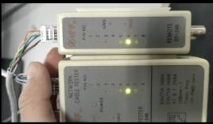

# 计算机网络第二次实验报告

## 实验目的：

1. 通过实际的动手操作制作水晶头线体会具体的网线构成
2. 通过虚拟仿真模拟综合布线，从而了解到实际的布线

## 实验内容：

1. 制作实际的水晶头网线，并测试是否八根线都可以通过
2. 通过虚拟仿真实验完成一次模拟综合布线系统的布置

## 实验步骤：

1. 制作水晶头：剪线->排线->压线->测试
2. 虚拟仿真实验：布线->安排各类设备和线缆布局

## 实验结果：

#### bug：

## 结果分析：

1. 水晶头需要进行完整且准确的排线才可以最终通过数据
2. 综合布线系统虚拟仿真：在线缆/设备选择区域的需要按住该区域才可以顺畅的上下移动（滚轮无法流畅的上下移动选区），部分地方可能会出现卡住的bug，如：在对楼层设置电信间和设备间的时候会卡住（卡出奇怪的视角，且无法正常进行下一步）